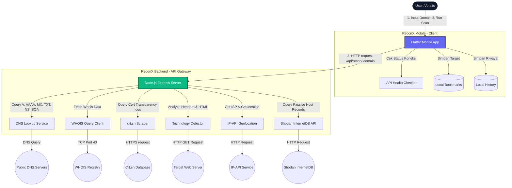

# ReconX Mobile - Passive Recon & OSINT Aggregator

ReconX Mobile adalah aplikasi mobile cross-platform (Flutter) yang berfungsi sebagai agregator layanan intelijen pasif (passive reconnaissance) dan OSINT (Open Source Intelligence). Proyek ini dirancang untuk mahasiswa cybersecurity, bug hunter, dan analis IT security untuk mempermudah pencarian informasi awal target tanpa berinteraksi langsung (passive footprinting).

---

## 📐 Arsitektur Sistem & Alur Data (Flowchart)

Berikut adalah diagram alir sistem mulai dari input domain oleh pengguna di aplikasi mobile hingga pengambilan data dari API eksternal secara pasif oleh backend server:



---

## 🛠️ Cara Menjalankan Project

### 1. Prasyarat (Prerequisites)
Pastikan sistem Anda sudah terpasang perkakas berikut:
*   [Node.js](https://nodejs.org/) (versi 16 atau lebih baru)
*   [Flutter SDK](https://docs.flutter.dev/get-started/install) (versi 3.0 atau lebih baru)
*   Google Chrome (untuk web preview) atau Emulator Android (untuk mobile preview).

---

### 2. Konfigurasi & Jalankan Backend
Backend bertindak sebagai proxy API server untuk menghindari masalah CORS pada perangkat seluler dan melakukan lookup secara efisien.

1.  Buka terminal baru dan masuk ke direktori backend:
    ```bash
    cd reconx_backend
    ```
2.  Pasang dependensi Node.js:
    ```bash
    npm install
    ```
3.  Pastikan konfigurasi port di file `.env` sudah benar (secara bawaan port `3000`):
    ```env
    PORT=3000
    ```
4.  Jalankan server API:
    ```bash
    node server.js
    ```
    Jika berhasil, Anda akan melihat output:
    `🚀 ReconX Backend running on port 3000`

---

### 3. Jalankan Aplikasi Mobile (Flutter)
Aplikasi seluler secara dinamis mendeteksi platform target. Jika Anda menjalankannya pada Android Emulator, aplikasi akan mengarahkan request ke `http://10.0.2.2:3000` secara otomatis. Jika dijalankan di desktop/web Chrome, aplikasi menggunakan `http://localhost:3000`.

1.  Buka terminal baru lagi dan masuk ke direktori frontend:
    ```bash
    cd reconx_mobile
    ```
2.  Ambil paket dependensi Flutter:
    ```bash
    flutter pub get
    ```
3.  Jalankan aplikasi di browser Chrome (Paling Direkomendasikan & Tercepat):
    ```bash
    flutter run -d chrome
    ```
    Atau jika Anda memiliki emulator Android aktif:
    ```bash
    flutter run -d android
    ```
    Atau jalankan sebagai aplikasi Linux native (membutuhkan perkakas `ninja-build` terpasang di distro Anda):
    ```bash
    flutter run -d linux
    ```

---

## ⚙️ Fitur-Fitur Utama di UI/UX Baru
*   **API Connection Status**: Status online/offline backend secara realtime yang terletak di pojok kanan atas beranda.
*   **Search Filters**: Kotak pencarian tambahan pada fitur Subdomain Finder dan Cheatsheet Payload untuk menyaring ribuan baris data secara instan.
*   **Category Sidebar**: Tampilan vertikal sidebar yang memudahkan pergantian kategori payload cheatsheet.
*   **Left-border Color Coding**: Identifikasi tipe rekaman data menggunakan garis warna vertikal minimalis di sisi kiri kartu hasil scan (layaknya standar dashboard modern).
